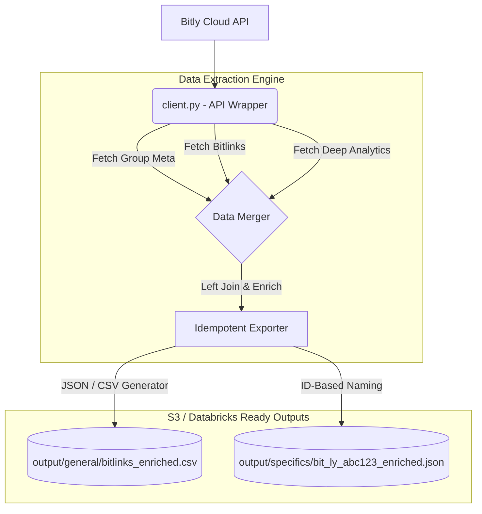

<p align="center">
  
  
  
  
  
  
</p>

<h1 align="center">🚀 BitlyReader</h1>
<p align="center">
  <strong>A world-class, enterprise-grade data pipeline and CLI for securely managing, shortening, and extracting deep analytics from Bitly links.</strong><br>
  Idempotent Exports • Interactive Dashboard • Multi-Format Generation • Clean Architecture
</p>

---

## 📖 Description

**BitlyReader** is a premium Python CLI application built to solve the fragmentation of link analytics. It provides a highly reliable, perfectly formatted pipeline to extract thousands of shortened links and their engagement metadata (total clicks, geographic breakdowns, top referring domains) into consolidated datasets, fully prepared for Data Engineering ingestion. 

## 🎯 Project Scope

1. **Analytical Pipeline**: Automatically scans Bitly Groups, securely fetches deep engagement metrics (clicks, referrers, countries), and merges them into a clean, unified schema.
2. **Double Execution Modes**: Offers a gorgeous graphical terminal menu for power users, while also supporting headless, flag-based execution (`--export`, `--shorten`) for seamless cron job/Databricks automation.
3. **Cumulative Idempotency**: Export filenames use strict Group IDs and Link IDs (`output/specifics/bit_ly_3Q9wdIl.csv`), abandoning fragile timestamps. If run multiple times, it gracefully updates local datasets without duplication or data loss.
4. **Link Management**: Allows users to seamlessly shorten long URLs, assign custom domains, and attach custom titles directly from the terminal without opening a browser.

---

## 📚 Table of Contents

- [📖 Description](#-description)
- [🎯 Project Scope](#-project-scope)
- [🏗️ Architecture](#️-architecture)
- [✨ Key Features](#-key-features)
- [🛠️ Installation & Setup](#️-installation--setup)
- [🚀 Usage Examples & Expected Outputs](#-usage-examples--expected-outputs)
- [📂 Project Structure](#-project-structure)
- [🧪 Testing & Code Quality](#-testing--code-quality)
- [📜 License](#-license)

---

## 🏗️ Architecture

The application is built on a modular, decoupled architecture, separating the API networking layer from the file formatting and presentation logic.



---

## ✨ Key Features

- **Blazing-Fast Interactive UI**: Built with `rich` and `questionary`, it features fully navigable keyboard menus (Up/Down arrows) replacing tedious text prompts.
- **Strict Idempotency**: Safely rerun the extraction pipelines as many times as you want. Export names map exactly to the Bitlink ID, removing timestamp-based file clutter and preventing multi-language encoding bugs (like `Éxito`).
- **Simultaneous Multi-Format Exports**: Extract data to both `.csv` and `.json` in a single pass using the `--export both` command.
- **Enterprise Security**: Implements rigorous sanitization for CSV Formula Injection (prepends `'` to dangerous `=`,`+`,`-`,`@` characters) and sanitizes filenames against Path Traversal vulnerabilities.
- **Robust Exception Handling**: Standardized error wrapping for network timeouts, `401 Unauthorized`, `429 Rate Limits`, and even gracefully catches `402 Upgrade Required` errors when your Bitly plan limits analytics access.

---

## 🛠️ Installation & Setup (Managed by uv)

We highly recommend using `uv`, the lightning-fast Python package installer and resolver from Astral, which replaces pip and virtualenv.

```bash
# Clone the repository
git clone https://github.com/yourusername/BitlyReader.git
cd BitlyReader

# Optional: Install globally as an executable tool via uv
uv tool install .

# Initialize environment and install dependencies locally
uv sync

# Run dynamically via uv without installing globally:
uv run main.py --help
```

### Authentication Configuration

To communicate with Bitly, you need a **Generic Access Token**.
1. Log in to your Bitly account and visit Settings -> API.
2. Click **Generate Token**.
3. Create a `.env` file in the project root:
   ```bash
   cp .env.example .env
   ```
4. Fill in your token: `BITLY_ACCESS_TOKEN=your_token_here`

Alternatively, if you run the CLI without it, it will gracefully pause and prompt you to securely paste the token into the terminal!

---

## 🚀 Usage Examples & Expected Outputs

### 0. Global Help & Commands Reference

The CLI includes an automatically generated, world-class `--help` menu that serves as your interactive manual:

```bash
uv run main.py --help
```

**Expected Output:**
```text
usage: BitlyReader [-h] [--list] [--shorten SHORTEN] [--title TITLE]
                   [--analytics ANALYTICS] [--export {csv,json,both}]
                   [--with-analytics] [--bitlink BITLINK]
                   [--group-guid GROUP_GUID]

BitlyReader CLI 🚀
A world-class data pipeline for consuming, shortening, and exporting Bitly link analytics.
----------------------------------------------------------

options:
  -h, --help            show this help message and exit
  --export {csv,json,both}
                        Export bitlinks directly.
  --with-analytics      Fetch and include detailed analytics for each exported bitlink.

Examples:
  Launch the interactive graphical menu:
  $ uv run main.py

  Export all links in both CSV and JSON formats with analytics:
  $ uv run main.py --export both --with-analytics
```

**Command Cheat Sheet:**

| Action | Command |
|---|---|
| **Interactive Menu** | `uv run main.py` |
| **List Group Links** | `uv run main.py --list` |
| **Shorten URL** | `uv run main.py --shorten https://github.com --title "GitHub"` |
| **View Analytics** | `uv run main.py --analytics bit.ly/abc1234` |
| **Export All Links** | `uv run main.py --export both --with-analytics` |
| **Export Single Link**| `uv run main.py --export csv --bitlink bit.ly/xyz789` |


### 1. Interactive Graphical Menu (Recommended)

To experience the stunning UI, simply run the script without any flags:

```bash
uv run main.py
```

**Expected Output:**
```text
─────────────────────────────────────────────────────────────────────────────────
🚀 Bitly API Data Consumer & Shortener
─────────────────────────────────────────────────────────────────────────────────
? Main Menu:
  ❯ 1. Show account info & profile details
    2. Explore default group bitlinks and options
    3. Explore a specific group by index
    4. View analytics for any bitlink (direct input)
    5. Exit
```

### 2. Exporting Bitlinks & Analytics (Idempotent)

Extract a completely joined dataset containing both **Link Metadata** and **Deep Analytics**.

```bash
uv run main.py --export both --with-analytics
```

#### Exported Schema (CSV / JSON)
Outputs are automatically upserted into the `output/general/` or `output/specifics/` folders based on context.

| Column Name | Example Value | Description |
|---|---|---|
| `id` | bit.ly/3Q9wdIl | Unique Bitlink ID |
| `title` | Q3 Planning Doc | The title of the link |
| `long_url` | https://docs.google.com/... | Original destination URL |
| `total_clicks` | 1450 | Aggregated total engagement |
| `countries` | [{"value": "US", "clicks": 900}] | Granular geographic breakdown |
| `referrers` | [{"value": "twitter.com", "clicks": 30}] | Granular referrer breakdown |
| `created_at` | 2026-06-04T10:30:19Z | Original creation UTC timestamp |
| `last_updated` | 2026-06-06 14:00:00 | Extraction runtime timestamp |

---

## 📂 Project Structure

```text
BitlyReader/
├── .env                        # Secure credential storage
├── output/                     # Local master JSON/CSV dataset exports
│   ├── general/                # Bulk group exports (bitlinks_enriched.csv)
│   └── specifics/              # Single link exports (bit_ly_xyz_enriched.csv)
├── client.py                   # Core API Networking and Auth
├── exporter.py                 # File formatting and Security Sanitization
├── main.py                     # CLI Entrypoint & Routing
├── pyproject.toml              # Dependencies (managed by uv)
├── README.md                   # This document
└── test_*.py                   # Comprehensive Pytest suites
```

---

## 🧪 Testing & Code Quality

This project maintains rigorous enterprise testing and code quality standards, completely governed by the strict **PEP8 79-character line limit**.

### Running Unit Tests

We use `pytest` with comprehensive `unittest.mock` patching to ensure tests run in under `0.5s` and are completely network-independent. Current coverage stands at **85%+ overall** (and effectively 100% for core logic pipelines).

```bash
uv run pytest --cov=client --cov=exporter --cov=main .
```

### Static Type Checking (Mypy)

To guarantee type safety and eliminate runtime `TypeError` issues, the codebase enforces strict static typing (`disallow_untyped_defs = True`).

```bash
uv run mypy .
```

### Enterprise Audit Logging

For compliance and data governance, `BitlyReader` implements background audit mechanisms:
1. **System Diagnostics**: All operational logs are silently streamed to `./logs/run.log`.
2. **Data Export Audit Ledger**: Every time an export finishes, an immutable JSON record is appended to `./logs/audit.jsonl` noting the timestamp, the number of records extracted, and the output format.

We use `ruff` as an extremely strict and fast Python linter and formatter. The codebase maintains zero linting warnings.

```bash
# Check for linting errors and automatically fix safe issues
uv run ruff check .
uv run ruff format .
```

---

## 📜 License

This project is open-sourced software licensed under the **[MIT License](LICENSE)**.
